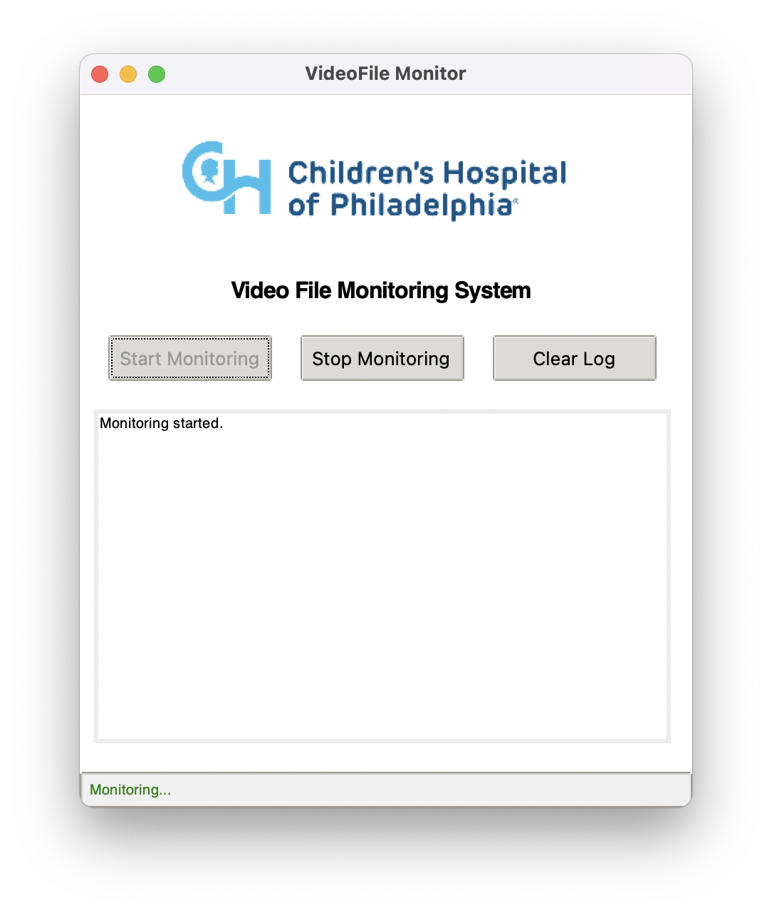

# Video Processing and Monitoring Application

This application efficiently monitors a designated directory for incoming video files, processes them, and updates a database with the results. It features a user-friendly GUI for seamless interaction and leverages Kafka for robust message brokering.

## Tech Stack

- **Python**: Core programming language
- **Kafka**: Message broker for reliable data streaming between components
- **FFmpeg**: Powerful video processing and conversion tool
- **SQLite**: Lightweight file-based database system
- **Tkinter**: Simple GUI framework for user interface
- **Docker**: Containerization for consistent environments
- **Watchdog**: Real-time file system monitoring
- **smtplib**: Email notification system
- **dotenv**: Secure environment variable management
- **Tenacity**: Retry logic for failed operations
- **Subprocess**: External process execution handler
- **Threading**: Concurrent task execution for better performance


## Installation

1. **Clone the repository**:
   ```bash
   git clone https://github.com/gokul-ml2ds/video-ingestion-pipeline.git
   cd video-ingestion-pipeline
   ```

2. **Create a Virtual Environment**:
   Navigate to your project directory and create a virtual environment if it doesn't exist:
   ```bash
   python3.11 -m venv video_env
   ```

3. **Activate the Virtual Environment**:
   - On macOS and Linux:
     ```bash
     source video_env/bin/activate
     ```
   - On Windows:
     ```bash
     .\video_env\Scripts\activate
     ```

4. **Install Dependencies**:
   With the virtual environment activated, install the required packages:
   ```bash
   pip install -r requirements.txt
   ```
## System Requirements

Before running the application, ensure the following are installed via Homebrew:

1. **FFmpeg**: Required for video processing.
   ```bash
   brew install ffmpeg
   ```

2. **Python Tkinter**: Required for the GUI.
   ```bash
   brew install python-tk@3.11
   ```
## Docker Setup

1. **Install Docker Desktop**: Download and install Docker Desktop from [Docker's official website](https://www.docker.com/products/docker-desktop).

2. **Start Docker Desktop**: Open Docker Desktop and ensure it is running.

## Running the Application with Docker Compose

1. **In a new terminal, navigate to the project directory**:
   ```bash
   cd video-ingestion-pipeline
   ```

2. **Build and start the services**:
   ```bash
   docker-compose up --build
   ```

3. **Stop the services**:
   To stop the services, press `Ctrl+C` in the terminal where `docker-compose` is running, or run:
   ```bash
   docker-compose down
   ```

## Environment Variables

Create a `.env` file in the root directory with:

```
EMAIL_USER=your_email@example.com
EMAIL_PASSWORD=your_email_password
```

## Email Configuration

To enable email notifications, you need to set up an app-specific password for your Gmail account. Follow these steps:

1. **Enable Two-Factor Authentication**:
   - Ensure that two-factor authentication (2FA) is enabled on your Google account.

2. **Generate an App-Specific Password**:
   - Visit [Google's App Passwords page](https://support.google.com/accounts/answer/185833?hl=en).
   - Sign in to your Google account if prompted.
   - Select "Mail" as the app and "Other" as the device, then enter a custom name (e.g., "Video Ingestion App").
   - Click "Generate" to create the password.
   - Copy the generated password.

3. **Update the `.env` File**:
   - Open the `.env` file in the root of your project.
   - Set the `EMAIL_PASSWORD` variable to the app-specific password you generated:
     ```plaintext
     EMAIL_PASSWORD=your_app_specific_password_here
     ```

4. **Save and Secure**:
   - Save the `.env` file and ensure it is not shared publicly or committed to version control.

## Running the Application

After setting up Docker and starting the services, follow these steps to run the application:

1. **Run the Orchestrator**:
   Open a terminal and navigate to the project directory, then execute:
   ```bash
   python orchestrator.py
   ```

   This will launch the GUI for the File Monitoring App.

2. **Run the Consumers**:
   In a separate terminal, navigate to the project directory, then execute:
   ```bash
   python run_consumers.py
   ```

These scripts will start the file monitoring and processing components of your application.


## Application Overview

This application monitors a specified directory for video files, processes them, and updates a database with the results.

### Directory Structure

- **Monitoring Directory**: The application monitors the `videos` folder for new video files.
- **Processed Videos**: Processed videos are saved in the `processed_videos` folder.
- **Logs**: Logs are displayed in the terminal.
- **Database**: Updates are made to the `video_status.db` database.

### File Structure

- **scripts**: Contains the main logic for processing videos and metadata.
  - `process_video.py`: Handles video processing tasks, including updating the database with processing status.
  - `metadata_check.py`: Checks for metadata files associated with videos and sends notifications if missing.
  - `quality_check.py`: Evaluates the quality of video files and logs the results.

- **utils**: Contains utility functions and scripts for file monitoring and processing.
  - `database.py`: Provides functions to ensure the database is set up and to update video processing statuses.

- **app**: Contains the GUI for the application.
  - `gui.py`: Implements the graphical user interface using Tkinter, allowing users to start and stop file monitoring.

- **orchestrator.py**: Launches the GUI and initializes the file monitoring process.
- **file_monitor.py**: Monitors the specified directory for new video files and triggers processing.
- **run_consumers.py**: Starts the consumer scripts that handle video processing and metadata checks.

### GUI Overview

- **Start Monitoring**: Begins monitoring the `videos` directory for new files.
- **Stop Monitoring**: Stops the monitoring process.
- **Clear Log**: Clears the log display in the GUI.
- **Status Bar**: Displays the current status of the monitoring process.




